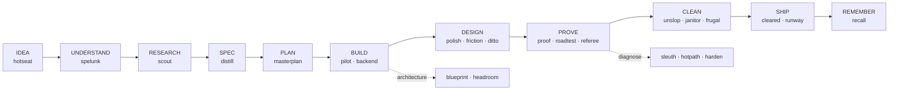
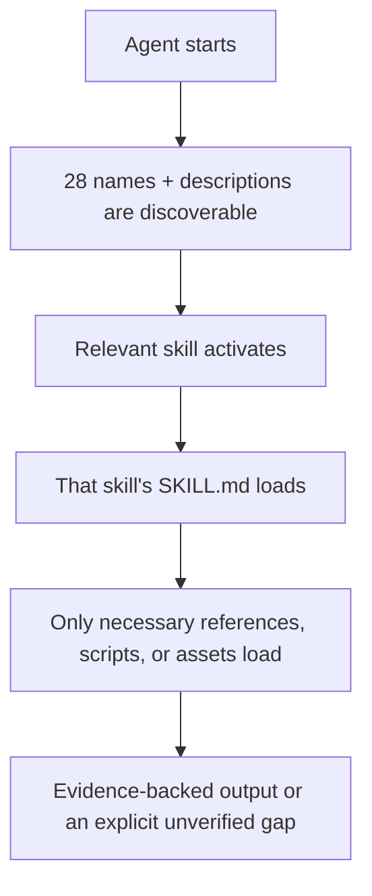

# Skills

### The complete implementation of a 28-skill vibe-coding toolkit.

Twenty-seven research-backed specialists for the work between “I have an
idea” and “it is live in production.” Each skill owns one job, carries its own
restraints and verification contract, and loads only when it is relevant.

The workflows and package contracts are complete. Cross-runtime compatibility
and comparative outcomes remain empirical questions for the separate proof
phase; this release makes no benchmark-superiority claim.

```bash
npx skills add udaysharmadev/Skills --all
```

Then run `/concierge`. It reads the project, checks which capabilities are
available, and routes the request to the smallest useful workflow.

> Building one feature, fixing one bug, or cleaning one frightening repo: you
> do not need to memorize 28 commands. Start with the concierge.

## From idea to production



This is a map, not a mandatory chain. Most requests need one skill. Larger
workflows compose only where the next specialist needs the previous one’s
output.

## Why this is different

### Research-backed depth

Every skill received an individual research pass. Its provenance note records
the lessons that changed behavior, where those lessons were encoded, rejected
ideas, and knowledge that should be refreshed as the field moves. The
[research index](docs/research/README.md) keeps that evidence browseable without
putting it into runtime context.

### Specialist judgment

These are not “act like an expert” prompts.

- `sleuth` keeps competing hypotheses alive until an experiment separates them.
- `headroom` attaches a trigger metric to every scaling recommendation—and
  tells you what not to build yet.
- `harden` separates severity, confidence, exploit preconditions, and impact.
- `unslop` protects load-bearing weirdness instead of rewriting everything clean.
- `frugal` optimizes successful-task token cost, never raw token count.
- `runway` verifies the deployed fingerprint through the public URL, not the
  command’s exit code.

### Progressive disclosure

Twenty-seven skills do not become one enormous system prompt. Discovery sees
compact names and descriptions; the relevant `SKILL.md` loads on demand; only
its necessary references or helper scripts load after that. This follows the
[Agent Skills specification](https://agentskills.io/specification).

### Restraint is part of the product

Every skill says when not to use it, when to stop, what it cannot verify, and
which actions need the user’s approval. No rewrite for activity. No security
theater. No deploy that quietly becomes an infrastructure migration.

### One portable core

The core is Markdown, self-contained skill folders, conditional references,
small standard-library helpers, and explicit fallbacks. Richer runtimes can add
browsers, web research, subagents, or GitHub access; missing capabilities reduce
the evidence available, not the honesty of the answer. See the
[compatibility matrix](docs/compatibility.md).

## Just talk normally

| You say | The likely owner |
| --- | --- |
| “I want to build a GitHub doom-scroller.” | [`hotseat`](skills/hotseat/) |
| “I don’t understand this repo.” | [`spelunk`](skills/spelunk/) |
| “Bro, make this dashboard stop looking AI generated.” | [`polish`](skills/polish/) |
| “I’ve vibe coded for three weeks and now I’m afraid to touch it.” | [`unslop`](skills/unslop/) |
| “Why does checkout fail only sometimes?” | [`sleuth`](skills/sleuth/) |
| “Can this handle 100k users?” | [`headroom`](skills/headroom/) |
| “Check everything before I ship.” | [`cleared`](skills/cleared/) |
| “Deploy it, then prove the new version is live.” | [`runway`](skills/runway/) |

Still unsure? `/concierge` is the front door. The beginner-friendly
[skill chooser](docs/choosing-a-skill.md) covers the rest.

## The 28 specialists

### Think

- [`concierge`](skills/concierge/) — inspect the project and route the smallest sufficient workflow.
- [`handsfree`](skills/handsfree/) — stop babysitting the agent. Routine decisions are autonomous; only real human gates interrupt you.
- [`hotseat`](skills/hotseat/) — stress-test an idea through seven genuinely different lenses.
- [`spelunk`](skills/spelunk/) — map an unfamiliar repository without reading it blindly.
- [`scout`](skills/scout/) — replace stale API memory with version-pinned evidence.
- [`distill`](skills/distill/) — turn a vague request into a compact, executable brief.
- [`masterplan`](skills/masterplan/) — produce vertical slices grounded in files that exist.
- [`recall`](skills/recall/) — preserve decisions and expensive lessons without dumping transcripts.

### Build

- [`pilot`](skills/pilot/) — execute an approved plan one verified slice at a time.
- [`backend`](skills/backend/) — protect server contracts, data integrity, auth, jobs, and migrations.
- [`blueprint`](skills/blueprint/) — document real architecture with diagrams that render.
- [`headroom`](skills/headroom/) — design for today, the next threshold, and eventual scale.

### Experience

- [`polish`](skills/polish/) — give interfaces hierarchy and character without generated-UI clichés.
- [`friction`](skills/friction/) — find where real users hesitate, backtrack, or fail.
- [`ditto`](skills/ditto/) — recreate a reference UI through repeated visual comparison.

### Prove

- [`proof`](skills/proof/) — put regression protection at the cheapest boundary that catches the bug.
- [`roadtest`](skills/roadtest/) — walk critical paths in a real browser and keep the evidence.
- [`sleuth`](skills/sleuth/) — establish a causal chain before touching the fix.
- [`referee`](skills/referee/) — review intent first, engineering quality second.
- [`hotpath`](skills/hotpath/) — measure, change one thing, measure again, keep or revert.
- [`harden`](skills/harden/) — reduce attack surface with scoped, evidence-backed findings.

### Clean & publish

- [`unslop`](skills/unslop/) — remove accidental complexity in small behavior-preserving batches.
- [`janitor`](skills/janitor/) — keep Git history and the GitHub surface honest and navigable.
- [`frontpage`](skills/frontpage/) — build READMEs from verified repository facts.
- [`findable`](skills/findable/) — fix crawlability and metadata without ranking promises.
- [`frugal`](skills/frugal/) — cut context waste while keeping the quality gate fixed.

### Ship

- [`cleared`](skills/cleared/) — issue a readiness verdict backed by fresh evidence.
- [`runway`](skills/runway/) — deploy at the platform’s natural level and verify it live.

For inputs, outputs, neighbors, and research links for every skill, use the
[human skill guide](docs/skills/README.md). The generated
[skill index](docs/skills/INDEX.md) mirrors the frontmatter exactly.

## A few worth meeting properly

<details>
<summary><strong>hotseat</strong> does not manufacture seven agreeable opinions</summary>

Each persona forms a verdict before seeing the others. The moderator detects
premature convergence, preserves real disagreement, and ends with assumptions,
an MVP cut line, and falsifiable kill criteria.
</details>

<details>
<summary><strong>polish</strong> bans the default, not the technique</summary>

Glass, gradients, cards, and motion are not inherently wrong. Thoughtless
decoration is. The skill starts from the product, existing tokens, real data,
interaction states, and screenshots at desktop and mobile widths.
</details>

<details>
<summary><strong>sleuth</strong> will not rent the bug</summary>

A fix needs a failing signal, competing hypotheses, a five-part causal chain,
and a regression test. Emergency workarounds remain visibly provisional.
</details>

<details>
<summary><strong>recall</strong> remembers less on purpose</summary>

Facts, decisions, current status, and hard-won lessons rot at different speeds.
They live in four small files with caps, TTLs, supersession, and no transcript
dumps.
</details>

## Install

Install the complete bundle:

```bash
npx skills add udaysharmadev/Skills --all
```

Choose skills interactively instead:

```bash
npx skills add udaysharmadev/Skills
```

Both commands use the public [skills CLI](https://www.skills.sh/). Discovery
and full-bundle installation were exercised in a clean directory on
2026-09-14; the repository does not document project/global flags it has not
validated.

After installation, run:

```text
/concierge
```

## How the bundle stays lean



Each `skills/<name>/` folder works when copied alone. Runtime skills refer to
neighbors by slug, never by repository-relative paths. The repository’s
`shared/` directory is for maintainers and validators, not a hidden runtime
dependency. Read the [architecture overview](docs/architecture/README.md) and
[handoff contract](docs/handoff.md) for the full model.

## Research, not prompt folklore

The research notes separate four kinds of evidence: official truth, research
evidence, implementation patterns, and community failure signals. Each note
records what changed the skill and where the idea landed in runtime files.
Fast-moving claims are marked for refresh; tempting but weak ideas are recorded
when relevant instead of quietly returning later.

Browse the [research provenance index](docs/research/README.md).

## Trust and safety

These skills can guide agents that edit code, run commands, browse external
content, operate Git, and deploy systems. Destructive and high-blast-radius
actions are explicitly gated; fetched content is treated as untrusted data;
capability fallbacks state what could not be verified. The source is fully
inspectable, but this bundle is not a security guarantee. See
[SECURITY.md](SECURITY.md).

## Documentation

- [Documentation home](docs/README.md)
- [Which skill do I need?](docs/choosing-a-skill.md)
- [Workflow recipes](docs/workflows.md)
- [Architecture](docs/architecture/README.md)
- [Compatibility](docs/compatibility.md)
- [Current maturity scorecard](docs/scorecard.md)

Implementation is complete for all 28 skills. Empirical outcome benchmarking
is a separate, intentionally deferred proof phase; no benchmark superiority is
claimed here.

## Contributing

Behavior changes need evidence, not another paragraph of generic “best
practices.” Read [CONTRIBUTING.md](CONTRIBUTING.md) before opening a pull
request.

MIT licensed. See [LICENSE](LICENSE).
