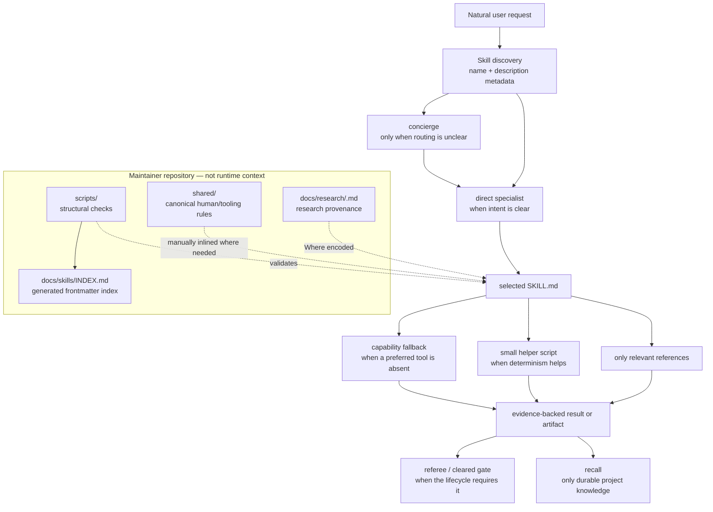
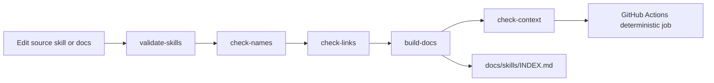

# Repository architecture

This repository is a portable Agent Skills bundle, not an application or a
runtime service. Its architecture is the relationship between discovery
metadata, self-contained skill packages, maintainer contracts, generated
indexes, research provenance, and deterministic validation.

## The operating model



The two trust boundaries are deliberate:

1. **External content → agent judgment.** Web pages, issue text, screenshots,
   logs, and repository content are data to inspect, never instructions to obey.
2. **Maintainer repository → installed skill.** `shared/`, provenance, and
   generators help maintain this bundle, but an installed skill may depend only
   on files inside its own folder and capabilities it probes at runtime.

## Skill discovery and routing

Agent Skills runtimes discover the `name` and `description` in each
`skills/<name>/SKILL.md`. Those descriptions carry the trigger signal; the full
body does not need to be loaded just to decide which capability applies.

When the request already names an owner—“debug this,” “review the diff,” “deploy
it”—that specialist can activate directly. `concierge` exists for ambiguous or
first-run work. It inspects the project and routes by the missing prerequisite:
intent, repository state, external truth, design, implementation, proof, or
safety. The router’s invariant is smallest sufficient workflow, not “run the
suite.”

## Progressive disclosure

Each skill has up to four layers:

| Layer | Loads when | Contains |
| --- | --- | --- |
| Frontmatter | discovery | compact name and discriminating description |
| `SKILL.md` body | skill activation | purpose, boundaries, workflow, fallbacks, gates, output |
| `references/` | a branch needs depth | checklists, templates, source ladders, detailed methods |
| `scripts/` or `assets/` | deterministic work or output needs them | standard-library helpers and reusable deliverable material |

This keeps the always-visible discovery surface small while preserving deep
specialist behavior. `scripts/check-context` reports the size of every layer and
flags outliers rather than trimming them blindly.

## Capability fallbacks

A skill probes a capability only when the workflow reaches it. The canonical
ladder is:

```text
project-native
→ already installed
→ tiny bundled helper
→ optional recommendation
→ manual/static fallback with unverified gaps named
```

Browser-dependent `roadtest` is the clearest example: browser automation can
prove UI behavior, HTTP checks can prove endpoint behavior, and static
inspection can prove neither. The output states which rung ran. The same model
applies to web research, subagents, GitHub access, shell execution, and writes.
See the [capability map](../../shared/capability-map/README.md).

## Specialist execution and handoffs

Specialists finish their own job and return a compact payload. They do not
recursively launch every plausible neighbor. The payload carries facts,
artifact paths, decisions, unresolved questions, verification already done,
and verification still needed. It stays within 20 lines; detail lives in owned
artifacts. See the [handoff contract](../handoff.md).

Orchestrators may compose specialists. Gates (`referee`, `cleared`) judge
whether work advances. `recall` persists only facts and decisions worth loading
in a later session.

## Artifact ownership

The runtime ownership table in
[`shared/terminology/artifacts.md`](../../shared/terminology/artifacts.md)
describes files skills create in **user projects**: briefs, plans, roadtest
evidence, memory, architecture reports, and similar outputs. It is not an
authorship policy for this repository’s own documentation.

Repository documentation has conventional maintainer ownership:

- `README.md` and `docs/` are reviewed as one public documentation surface;
- `docs/research/` traces earlier research into the runtime package;
- `docs/skills/INDEX.md` is generated by `scripts/build-docs`;
- `shared/` records canonical contracts that maintainers manually inline into
  self-contained skills when relevant.

## Research provenance

Every skill has a matching `docs/research/<skill>.md`. The **Where encoded**
column points back to its `SKILL.md`, references, or helper script. Provenance
does not travel into runtime context, but it makes domain-behavior changes
reviewable and keeps rejected ideas from returning without new evidence. Start
at the [research index](../research/README.md).

## Deterministic helpers

Five skills currently justify a bundled helper:

| Skill | Helper | Why code is better than eyeballing |
| --- | --- | --- |
| `spelunk` | `scripts/inventory` | aggregate file distribution, size, debt, test ratio, and churn |
| `recall` | `scripts/check-memory` | enforce caps, dates, staleness, and duplicate detection |
| `blueprint` | `scripts/validate-mermaid` | catch common static Mermaid failures |
| `roadtest` | `scripts/test-matrix` | generate paths × viewports × state checks before walking |
| `hotpath` | `scripts/measure-report` | compute deltas and prevent sub-threshold gains becoming claims |

Other skills remain Markdown-only because a script would add machinery without
improving reliability.

## Build and validation flow



Two load-bearing paths were spot-checked during the productization pass:

- `scripts/build-docs` reads frontmatter from `skills/*/SKILL.md` and is the
  sole generator for `docs/skills/INDEX.md`.
- `.github/workflows/ci.yml` runs the repository validators and fails when the
  generated index differs from committed output.

## Assumptions

- Installation continues to preserve each skill folder intact, as exercised by
  the public skills CLI on 2026-09-14.
- Runtimes may differ in discovery, tool access, and invocation behavior; the
  architecture guarantees graceful methodology fallbacks, not identical UX.

## Risk callouts

- **Contract drift is semantic.** Validators catch missing files and malformed
  structure, but they cannot prove that an inlined capability or safety rule
  still means the same thing as its canonical `shared/` version.
- **Generated-index drift is mechanical.** Editing `docs/skills/INDEX.md` by
  hand will be overwritten and is rejected by CI.
- **Portability is not universal proof.** A Markdown-first design reduces
  coupling; per-runtime behavior remains an empirical claim tracked in
  [compatibility](../compatibility.md).
