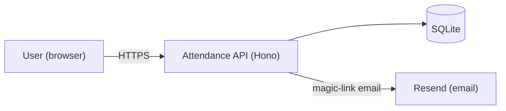
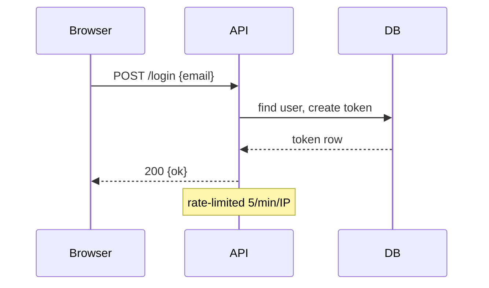
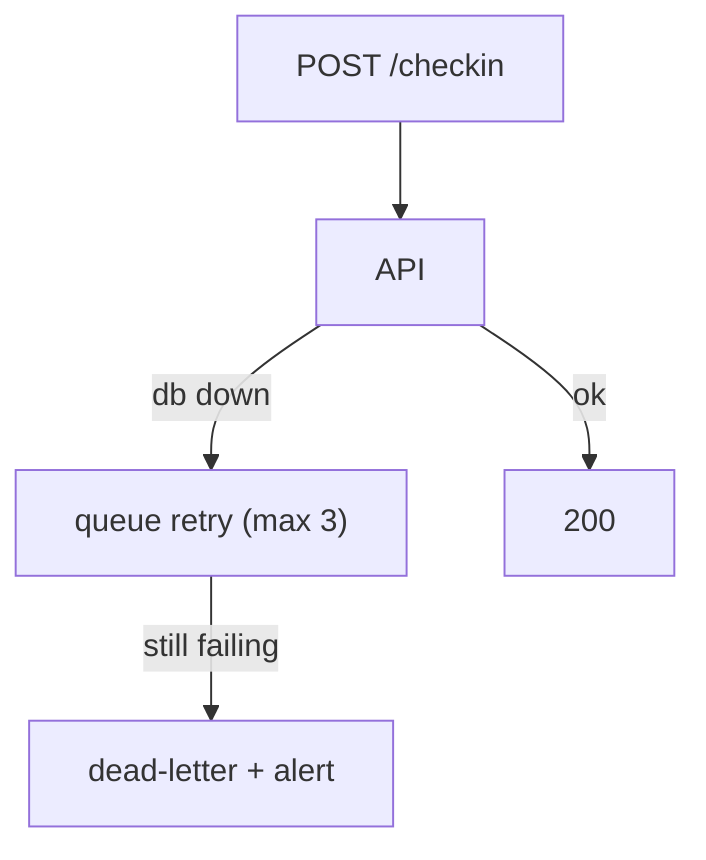
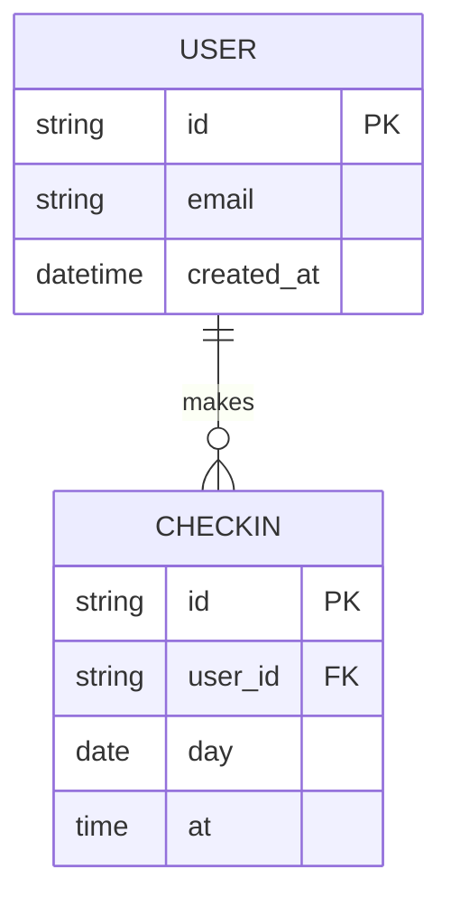

# Diagram menu + Mermaid patterns

## The menu: question → diagram

| The reader's question | Diagram | Mermaid type |
| --- | --- | --- |
| What is this system and what's around it? | System context (C4 L1) | `flowchart LR` |
| What are the major deployable pieces? | Containers (C4 L2) | `flowchart LR` with subgraphs |
| How is the code organized inside an app? | Components (C4 L3) | `flowchart TB` |
| What happens when a request comes in? | Request sequence | `sequenceDiagram` |
| How does data move and where does it live? | Data flow / ER | `flowchart TD` / `erDiagram` |
| What happens when X fails? | Failure path | `flowchart TD` (red edges) |
| How is it deployed and released? | Deployment / CI | `flowchart LR` grouped by env |
| Where are the trust boundaries / threat vectors? | Threat Model | `flowchart TD` with `subgraph` for zones |
| Who does what over time (async)? | Event flow | `sequenceDiagram` |

Pick by question, not by completeness. 3–5 diagrams usually cover it.

## Style rules (all diagrams)

- `%%{init: {'theme':'dark'}}%%` is unnecessary — the HTML template
  themes them; keep sources theme-neutral.
- Node labels: real names + a role hint: `api["API (Hono)"]`.
- Data stores: cylinder shape `[(Postgres)]`; external systems: box with
  dashed border for inferred, solid for verified.
- Max ~30 nodes; beyond that, split into two diagrams with one sentence
  linking them.
- **Explicit Trust Boundaries:** Use subgraphs (`subgraph TrustZone`) to demarcate where data crosses from public to private, or between different permission contexts. Security must not be an afterthought.
- Direction left-to-right for flows that follow time; top-down for structure.

## Patterns

### System context

### Request sequence

### Failure path

### ER

## HTML deliverable

The bundled HTML template (in this skill's assets folder) is the shell:
sidebar nav, content sections,
light/dark toggle, zoom buttons per diagram, print CSS. Fill every
placeholder (`{{TITLE}}`, nav items, sections); delete sections you don't
use. Diagrams render via Mermaid from CDN — if the reader is offline the
template shows a notice pointing at the `.mmd` files (which is also why
the `.mmd` sources always ship alongside).

Print-friendly means: `@media print` in the template collapses the
sidebar, forces light theme, and avoids page-breaks inside diagrams —
verify with a print preview before shipping.
